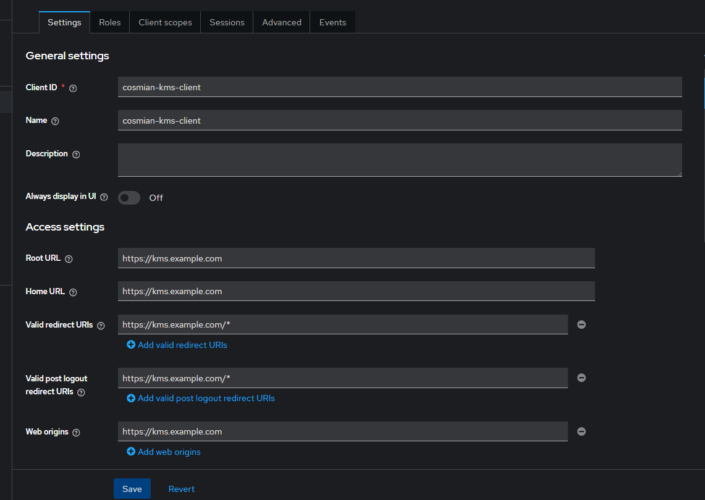
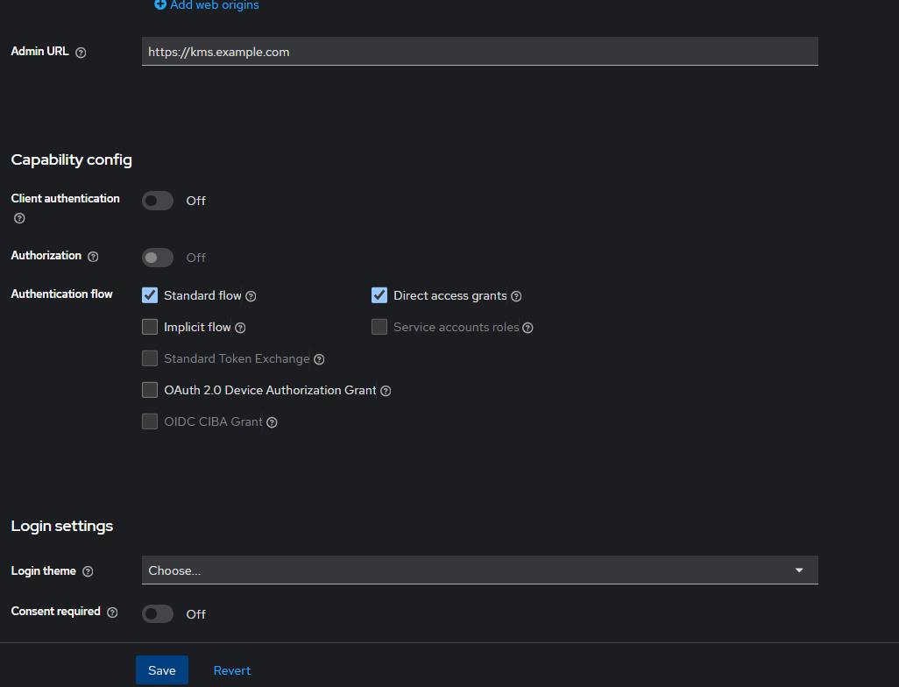

openssl req -x509 -nodes -days 365 -newkey rsa:2048 -keyout kms.key -out kms.crt

openssl pkcs12 -export -out cosmian-kms.p12 -inkey kms.key -in kms.crt -certfile intermediate.crt
a123
-certfile intermediate.crt (Tùy chọn): Nếu cần thêm chuỗi chứng chỉ trung gian (Intermediate Certificate) để đảm bảo độ tin cậy.

---
### Cấu hình Keycloak with cosmian-kms
1. Cấu hình Clients trong realm cần cài đặt

2. Cấu hình domain trong hosts `127.0.0.1 kms.example.com`
3. Truy cập ứng dụng với đường dẫn `https://kms.example.com/ui/login`